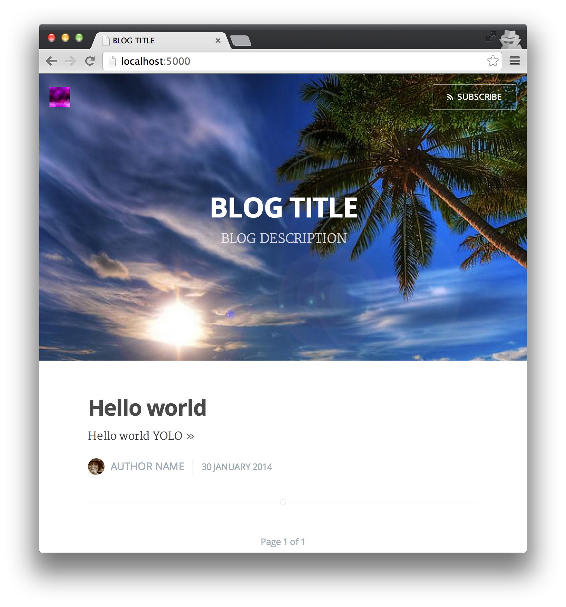

# ghost-render

Renders static blog sites from Markdown using [Ghost themes](http://marketplace.ghost.org/).

## Features

- Renders a blog from Markdown using [themes](http://marketplace.ghost.org/)  designed for [Ghost](https://ghost.org/).
- Beautiful themes from Ghost; rather than reinventing the wheel when it comes to writing layouts and helpers, you can get productive immediately with all the [Ghost theme features](http://themes.ghost.org/).
- Completely static output is easy to host anywhere.
- Generates:
  - individual blog post pages
  - blog home page: a paginated post list ordered by post date
  - author pages: a paginated post list by author and post date
  - tag pages: a paginated post list by tag and post date
- Static pages
- RSS feeds for the blog, for each author and for each tag
- Supports multiple authors
- Supports syntax highlighting via highlight.js

## Getting started

Install `ghost-render`: 

```bash
npm install -g ghost-render
```

Initialize a basic settings JSON file (mostly for Ghost-specific settings):

```bash
ghost-render --init > settings.json
```

Download a Ghost theme. There are a number of [free](http://marketplace.ghost.org/themes/free/) and [paid](http://marketplace.ghost.org/themes/paid/) Ghost themes - I'll use the default Casper theme from Ghost here:

```bash
git clone https://github.com/TryGhost/Casper.git
```

Create some content:

```bash
mkdir -p ./blog/2014/01/30/
echo "# Hello world\n YOLO" > ./blog/2014/01/30/hello-world.md
```

Run `ghost-render`:

```bash
ghost-render --input ./blog/ --settings ./settings.json --theme ./Casper --output ./tmp 
```

Open up the result in a browser (mostly because of `file://` URL security issues). Any HTTP server will work, I'll use the one built into Python:

```bash
cd ./tmp
python -m SimpleHTTPServer 5000
```

All done; here's a screenshot of the result:



## Adding metadata to each post

Each blog post can have metadata associated with it. To set the metadata, start your markdown file with a metadata block that looks like this:

```
---
title: Page title
published_at: 2014-01-30 11:26:04
author: foo
tags: foo bar
---
```

All of the post metadata is optional - see below for the fallback values.

You can also write HTML inside the posts and it will be included in the rendered page as-is. This can be handy for those moments where you need to produce very specific markup.

### title

`title` is used as the page title in the templates and the `<title>` tag.

The first heading in the markdown file is used if `title` is not set. If there is no first heading, the file name is used (without the file extension). 

### published_at

`published_at` determines the sorting order for posts, and it is used in the index templates to show when a post was made.

If `published_at` is not set, it is detected from the file path. If your file paths contain numbers that look like `yyyy-mm-dd`, then you don't need to explicitly set the `published_at` metadata value. 

Some examples of acceptable paths which are automatically parsed if the `published_at` value is missing:

- `2014/01/30/hello-world.md` (`yyyy-mm-dd`)
- `2014-01-30-hello.md` (`yyyy-mm-dd`)
- `30/01/2014/hello.md` (`dd-mm-yyyy`) 
- `30-01-2014-hello.md` (`dd-mm-yyyy`) 

If this detection fails to produce a result, the creation time of the file is used.

### author

`author` refers to an author by their short name (slug). It is used to fetch the author's metadata from the `settings.json` file, which will then be rendered by most templates as an author blurb somewhere in the page.

A per-author index of posts is generated for each author at `/author/:slug/` (e.g. `/author/mixu/`). An associated RSS feed is also generated at  `/author/:slug/rss/`. You can set the `slug` in `settings.json`.

If you leave the field blank, the author with the name `default` will be used (e.g. `authors.default` in `settings.json`).

### tags

`tags` contains a space-separated (`foo bar`) or comma-separated (`foo, bar`) list of tags. Each tag becomes a paginated collection of posts grouped by tag and sorted by `published_at`. The tag URL slug is generated by lowercasing the tag name and then replacing all non-alphanumeric characters with `-`.

A per-tag index of posts is generated for each tag at `/tag/:slug/` (e.g. `/tag/linux/`). 

If you leave the field blank, there are no tags and no tag index pages.

## How post and page URLs are determined

One of the things I dislike about most static site generators is how fiddly it is to get the exact URL structure you want. `ghost-render` is WYSIWYG in that what you have in your input directory structure is what you get in the output directory structure.

The only change is that `.md` files will have their extension changed to `.html`. Other than that, you can implement any directory structure you want, and the generated index pages will adjust to contain the correct URLs to your posts.

You can include non-markdown files. They are automatically copied into the output directory, maintaining the same relative paths.

BTW, if you want `/2014/01/30/post-name` to work as a link, name your markdown file `/2014/01/30/post-name/index.md`. This will become `/2014/01/30/post-name/index.html`, which makes pretty links work as expected.

Indexes are ordered by `published_at`. See the section on metadata about how this value is automatically detected.

### Publishing pages

Everything is a post by default, but you can set `page: true` in the metadata to render a file as a page. Pages are rendered using the Ghost page template, and they are not included in the post indices.

### Publishing drafts

Drafts are posts you’re still working on and don’t want to publish yet.

To mark a page or post as a draft, set `draft: true` in the metadata section. Drafts are excluded from the rendering pipeline.

## Configuring the blog

The blog is configured using the shared `settings.json` file. The `settings.json` file should contain the following shared fields:

```json
{
  "blog": {
    "url": "http://blog.example.com",
    "title": "Blog title",
    "description": "Blog description",
    "logo": ""
  },
  "authors": {
    "default": {
      "name": "Author name",
      "bio": "Author bio",
      "website": "http://blog.example.com",
      "image": "http://lorempixel.com/90/90/people/",
      "cover": "http://lorempixel.com/800/600/people/",
      "slug": "nick"    
    }
  }
}
```

The `blog` key contains information about the blog's URL, title and location:

- `blog.url` is used everywhere where absolute links are preferred (e.g. RSS links). Make sure you change this to match your production URL.
- `blog.title` is used in all the blog page headings and in most themes (same as `theme.title`)
- `blog.description` is used in most themes (same as `theme.description`) and embedded as a meta tag in the page `<head>`.
- `blog.logo` is made available for themes that want a large image to use somewhere in the theme.

The `authors` key is a hash, indexed by author short name. The `authors.default` key must be set. The `default` author is used on all posts that do not have a `author: authorname` metadata information. To support multiple authors, add more entries to the `authors` hash and then add the `author: somename` metadata entry for the posts written by that author.

- `author.name`: the name of the author
- `author.bio`: the author's bio
- `author.website`: the author's website
- `author.image`: the author's profile image (e.g. small picture shown next to the author bio). It seems the image should be 90 x 90px.
- `author.cover`: the author's cover image (e.g. large image shown in the background for author pages)
- `author.slug`: the author URLs are based this value. All posts written by a particular author are listed at `/author/{slug}/`.

## Customizing the theme

Take a look at the [Ghost themes documentation](http://docs.ghost.org/themes/) on how to write a theme and the helpers that are available in themes.

`ghost-render` uses code extracted from Ghost (0.5.x), so it should produce the same result in most cases. I've tested it casually, but not super extensively - if it works on Casper and a couple of other themes I tried so it's good enough for me. File pull requests or issues if you notice themes that don't work as expected. 

Ideally, the Ghost core team would package the core rendering functions separately so that simple static sites can take advantage of the same standard for writing themes. Not sure if they are interested, but I'd love to see something cleaner than what I've done here. 

## Converting a Wordpress blog

I used [wp2md](https://github.com/dreikanter/wp2md) to do the initial conversion. The markup requires a bit of touchup:

- the meta block needs a starting `---`
- the title is repeated in the first heading of the markdown output

but other than those manual changes everything was smooth.

# What would make this module easier to maintain?

Here are the main things that, if changed in Ghost core, would make this module easier to maintain:

- extracting the rendering into it's own module that is useable by other npm modules, like this renderer.
- dependency inversion for helpers. Instead of the helpers reaching into the rest of the core by requiring and calling various parts of the Ghost core, the rest of the core should call the rendering functions, passing in just the necessary data. This way, the helpers don't need to care about applying filters and loading additional data.
- The dependency inversion thing would also make what seems to be the initial version of apps (which operate via async filters) much nicer: they could be just written as through-streams.
- getting rid of the global configuration and settings API dependencies. In the Ghost codebase, helpers access the configuration and settings objects via top level requires by path. This means that one can't instantiate them with different configuration options (because the global settings would still be shared between the two, making it impossible to do two simultaneous builds with different configs). The helpers should be created with an instance of a configuration object instead, allowing them to work without having an extremely specific set of paths and dependencies present.
- getting rid of express-hbs. It's just doing a bit too much and adds an extra layer of wrapping that one needs to punch through to get to handlebars. It's just not granular enough. Having the rendering be built on just handlebars would be nice.
